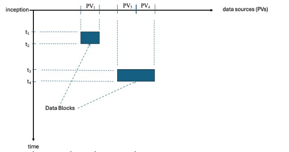

# dp-grpc repo

This repo contains the gRPC API definition for the Data Platform Ingestion, Query, and Annotation Services.  The [data-platform repo](https://github.com/osprey-dcs/data-platform) is the project home page and a good place to learn about the bigger picture.

This document includes the following information:

- [gRPC communication framework overview](#grpc-overview)
- [Data Platform gRPC API proto files](#data-platform-grpc-api-proto-files)
- [Data Platform API conventions](#data-platform-API-conventions)
- [Example Java code for calling the API](#example-java-grpc-api-code)
- [Service-centric API summary](#service-api-summary)
- [Entity-centric API summary](#entity-api-summary)
- [API use cases and patterns](#api-use-cases-and-patterns)
- [Entity API details](#entity-api-details)
  - [Provider API](#provider-api)
  - [PV Time-Series Data API](#pv-time-series-data-api)
  - [Ingestion Request Status API](#ingestion-request-status-api)
  - [Data Set API](#data-set-api)
  - [Annotation API](#annotation-api)


---
## gRPC Overview

The Data Platform API is built using the gRPC high-performance communication framework.

[gRPC is a framework](https://grpc.io/docs/what-is-grpc/introduction/) that allows a client application to call a method on a server application.  Defining an API with gRPC consists of identifying the services to be provided by the application, specifying the methods that can be called remotely for each service along with the method parameters and return types.

Underlying the gRPC framework is another Google-developed technology, [Protocol Buffers](https://protobuf.dev/overview), which is an open source mechanism for serializing structured data.  gRPC uses Protocol Buffers as both the Interface Definition Language (IDL), and as the underlying message interchange format.

The gRPC API is defined using "proto" files (a text file with a ".proto" extension).  Proto files contain definitions for services, service methods, and the data types used by those methods.  Data types are called "messages", and each message specifies a series of name-value pairs called "fields".  The definition of one message can be nested within another, limiting the scope of the nested data type to the message it is nested within.

Support is provided for compiling gRPC API code in a variety of [programming languages](https://grpc.io/docs/languages/).  The "protoc" compiler builds a framework of "stubs" in the target programming language for utilizing the API defined in the "proto" files.

See the links above for some simple examples of services, methods, and messages.


---
## Data Platform gRPC API Proto Files

The Data Platform API is defined in the following _proto_ files, located in this repo's ___src/main/proto___ directory:

- [___ingestion.proto___](https://github.com/osprey-dcs/dp-grpc/blob/main/src/main/proto/ingestion.proto) - Ingestion Service API
- [___query.proto___](https://github.com/osprey-dcs/dp-grpc/blob/main/src/main/proto/query.proto) - Query Service API
- [___annotation.proto___](https://github.com/osprey-dcs/dp-grpc/blob/main/src/main/proto/annotationproto) - Annotation Service API
- [___common.proto___](https://github.com/osprey-dcs/dp-grpc/blob/main/src/main/proto/common.proto) - Common data structures shared by  the Service APIs 


---
## Data Platform API Conventions

### ordering of elements

Within the Data Platform service proto files, elements are listed in the following order:

1. service method definitions
2. definition of request and response data types

### packaging of parameters for a method into a single "request" message

For all Data Platform service methods, parameters are bundled into a single "request" message data type, instead of listing multiple parameters to the method.

### naming of request and response messages

The service-specific proto files each begin with a "service" definition block that defines the method interface for that service, including parameters and return types.  Where possible, the data types for the request and response use message names based on the corresponding method name.

A simple example is the Ingestion Service method registerProvider(). The method request parameters are bundled in a message data structure called RegisterProviderRequest. The method returns the response message type RegisterProviderResponse.  So the method definition looks like this:

```
rpc registerProvider (RegisterProviderRequest) returns (RegisterProviderResponse);
```

A more complex example is the Ingestion Service RPC methods ingestDataBidiStream() (bidirectional streaming data ingestion API), ingestDataStream() (client-side streaming data ingestion API), and ingestData() (unary data ingestion API). We want the methods to use the same request and response data types, so we use the common message types IngestDataRequest and IngestDataResponse. This pattern is also used for time-series data queries defined in ___query.proto___.  The method definitions look like this:

```
rpc ingestData (IngestDataRequest) returns (IngestDataResponse);
rpc ingestDataStream (stream IngestDataRequest) returns (IngestDataStreamResponse);
rpc ingestDataBidiStream (stream IngestDataRequest) returns (stream IngestDataResponse);
```

### nesting of messages

Where possible, nesting is used to enclose simpler messages within the more complex messages that use them.  In cases where we want to share messages between multiple request or response messages, the definition of those messages appears after the request and response messages in the proto file.

### determining successful method execution

A common pattern is used across all Data Platform service method responses to assist in determining whether an operation succeeded or failed.  All response messages use the gRPC "oneof" mechanism so that the message payload is either an ExceptionalResult message indicating that the operation failed, or a method-specific message containing the result of a successful operation.

The ExceptionalResult message is defined in "common.proto" with an enum indicating the status of the operation and a descriptive message.  The enum indicates operations that were rejected, encountered an error in processing, failed to return data, resources that were unavailable when requested, etc.

Here is an example of the use of this pattern in the "QueryDataResponse" message used to send the result of time-series data queries:

```
message QueryDataResponse {

  oneof result {
    ExceptionalResult exceptionalResult = 10;
    QueryData queryData = 11;
  }

  message QueryData {

    repeated DataBucket dataBuckets = 1;

    message DataBucket {
      // DataBucket field definitions...
    }
  }
}
```

### empty query results

Another common pattern across Data Platform API query methods is in reporting empty query results.  When a query matches no data, the list of results in the query response message is empty.  For example, when a time-series data query method returns no data, the QueryDataResponse message (show above) contains an empty dataBuckets list.

---
## Example Java gRPC API Code

Here is a simple example of calling the registerProvider() API from Java, after running protoc to build Java stubs.

First the code to build a RegisterProviderRequest object from a "params" object containing the parameters for the request:

```
    public static RegisterProviderRequest buildRegisterProviderRequest(RegisterProviderRequestParams params) {

        RegisterProviderRequest.Builder builder = RegisterProviderRequest.newBuilder();

        if (params.name != null) {
            builder.setProviderName(params.name);
        }

        if (params.description != null) {
            builder.setDescription(params.description);
        }

        if (params.tags != null) {
            builder.addAllTags(params.tags);
        }

        if (params.attributes != null) {
            builder.addAllAttributes(AttributesUtility.attributeListFromMap(params.attributes));
        }

        return builder.build();
    }
```

And the code to invoke the API using the request object:

```
    protected static RegisterProviderResponse sendRegsiterProvider(
            RegisterProviderRequest request
    ) {
        final DpIngestionServiceGrpc.DpIngestionServiceStub asyncStub =
                DpIngestionServiceGrpc.newStub(ingestionChannel);

        final RegisterProviderUtility.RegisterProviderResponseObserver responseObserver =
                new RegisterProviderUtility.RegisterProviderResponseObserver();

        asyncStub.registerProvider(request, responseObserver);

        responseObserver.await();

        if (responseObserver.isError()) {
            fail("responseObserver error: " + responseObserver.getErrorMessage());
        }

        return responseObserver.getResponseList().get(0);
    }
```


---
## Service API Summary
The table below gives an overview of the Data Platform API organized by service.  Links to additional details are provided for each method category.

| Service    | API Methods |
|------------| ----------- |
| Ingestion  | [Provider&nbsp;registration](#provider-registration-methods)<br>[PV&nbsp;data&nbsp;ingestion](#pv-data-ingestion-methods)<br>[PV&nbsp;data&nbsp;subscription](#pv-data-subscription-methods)<br>[Request&nbsp;Status&nbsp;query](#request-status-query-methods)<br> |
| Query      | [PV&nbsp;data&nbsp;query](#pv-data-query-methods)<br>[PV&nbsp;metadata&nbsp;query](#pv-metadata-query-methods)<br>[Provider&nbsp;query](#provider-query-methods)<br>[Provider&nbsp;metadata&nbsp;query](#provider-metadata-query-methods)<br> |
| Annotation | [Data&nbsp;Set&nbsp;creation](#data-set-creation-methods)<br>[Data&nbsp;Set&nbsp;query](#data-set-query-methods)<br>[Data&nbsp;export](#data-export-methods)<br>[Annotation&nbsp;creation](#annotation-creation-methods)<br>[Annotation&nbsp;query](#annotation-query-methods)<br> |


---
## Entity API Summary

The table below gives an overview of the Data Platform API organized by entity.  A brief description of each entity is provided with links to additional details about API support for that entity.

| Entity   | Description | API Methods                                                                                                                                                                                                                                        |
|----------|-------------|----------------------------------------------------------------------------------------------------------------------------------------------------------------------------------------------------------------------------------------------------|
| Provider | An infrastructure component that sends correlated PV time-series data to the archive.  Might be associated with an EPICS IOC. | [Provider&nbsp;registration](#provider-registration-methods)<br>[Provider&nbsp;query](#provider-query-methods)<br>[Provider&nbsp;metadata&nbsp;query](#provider-metadata-query-methods)<br>                                                        |
| PV Time-Series Data | The core of the MLDP archive is correlated PV time-series data captured from devices in an accelerator facility. | [PV&nbsp;data&nbsp;ingestion](#pv-data-ingestion-methods)<br>[PV&nbsp;data&nbsp;query](#pv-data-query-methods)<br>[PV&nbsp;data&nbsp;subscription](#pv-data-subscription-methods)<br>[PV&nbsp;metadata&nbsp;query](#pv-metadata-query-methods)<br> |
| Ingestion Request Status | Data ingestion requests are handled asynchronously to maximize performance, so the disposition of individual requests is recorded in a Request Status record. | [Request&nbsp;Status&nbsp;query](#request-status-query-methods)<br>                                                                                                                                                                                |
| Data Set | A Data Set identifies PV data of interest in the archive through the use of Data Blocks, each one identifying a list of PVs and range of time. | [Data&nbsp;Set&nbsp;creation](#data-set-creation-methods)<br>[Data&nbsp;Set&nbsp;query](#data-set-query-methods)<br>[Data&nbsp;Set&nbsp;export](#data-set-export-methods)<br>                                                                      |
| Annotation | Annotations are used to annotate Data Sets in the archive with descriptive information, data associations, Calculations, and provenance tracking information. | [Annotation&nbsp;creation](#annotation-creation-methods)<br>[Annotation&nbsp;query](#annotation-query-methods)<br>                                                                                                                                 |


---
## API Use Cases and Patterns
The Data Platform API is intended to support the following use cases and patterns:
- Register ingestion data Providers, query Provider details and metadata.
- Ingest PV time-series data, either in continuous or batch mode.
- Monitor ingestion Request Status records for errors and other problems.
- Query PV time-series data and metadata.
- Create Data Sets identifying archive data blocks of interest by PVs and time range.
- Annotate Data Sets by adding descriptive information, linking to associated other Data Sets and Annotations, adding user-defined Calculations, and tracking data provenance.
- Query Annotations and identify Data Sets of interest.
- Export Data including both Data Sets and Calculations.


---
# Entity API Details

## Provider API

A data Provider is an infrastructure component that uses the Data Platform Ingestion Service API to upload data to the archive.  Before sending ingestion requests with data, the Provider must be registered with the Ingestion Service.  Query methods are provided to retrieve details about registered Providers and metadata about the data they have uploaded.

### Provider Registration Methods
<table>
<tr>
<td><pre>
rpc registerProvider (RegisterProviderRequest) returns (RegisterProviderResponse);
</pre></td>
</tr>
<tr>
<td>defined in: ingestion.proto</td>
</tr>
<tr>
<td>
Data providers must be registered with the Ingestion Service before they can send data to the archive via the ingestion API methods.  This is accomplished via the provider registration API method.

This unary method sends a single RegisterProviderRequest and receives a single RegisterProviderResponse.  It is required to call this method to register a data provider before calling one of the data ingestion methods using the id of that provider.

----

Provider name is required in the RegisterProviderRequest, which may also contain optional descriptive fields including description, tags, and key / value attributes.

----

The response message indicates whether the registration was successful.  The response payload is an ExceptionalResult if the request is unsuccessful, otherwise it is a RegistrationResult that includes details about the new provider including providerId (for use in calls to data ingestion methods) and a flag indicating if the provider is new.  On success, if a document already exists in the MongoDB "providers" collection for the provider name specified in the RegisterProviderRequest, the method returns the corresponding provider id in the response, otherwise a new document is created in the "providers" collection and its id returned in the response.

----

It is safe (and recommended) to call this method each time a data ingestion client is run.  If a document already exists in the MongoDB providers collection for the specified provider, the attributes are updated to the values in the RegisterProviderRequest.
</td>
</tr>
</table>


### Provider Query Methods
<table>
<tr>
<td><pre>
rpc queryProviders(QueryProvidersRequest) returns (QueryProvidersResponse);
</pre></td>
</tr>
<tr>
<td>defined in: query.proto</td>
</tr>
<tr>
<td>
The queryProviders() API method is used by clients to retrieve details about ingestion data Providers defined in the archive.  It accepts a single QueryProvidersRequest containing the query parameters and returns a single QueryProvidersResponse.  The response may indicate an exceptional result such as rejection or error in handling the request, otherwise it contains information about each Provider matching the query criteria.

----

A QueryProvidersRequest contains a list of criteria for querying Providers.  Criterion options include 1) IdCriterion for query by unique id, 2) TextCriterion for full text query over Provider name and description, 3) TagsCriterion for query by tag value, and 4) AttributesCriterion for query by attribute key and value.  The list may contain a single criterion or list of multiple criteria.  For example, the query might use both a TagsCriterion and AttributesCriterion to query over tags and attributes, respectively.

----

The response message payload is either an ExceptionalResult indicating rejection or an error handling the request, or a ProvidersResult with a ProviderEntry for each Provider matching the query criteria.
</td>
</tr>
</table>

### Provider Metadata Query Methods
<table>
<tr>
<td><pre>
rpc queryProviderMetadata(QueryProviderMetadataRequest) returns (QueryProviderMetadataResponse);
</pre></td>
</tr>
<tr>
<td>defined in: query.proto</td>
</tr>
<tr>
<td>
The queryProviderMetadata() API method is used by clients to retrieve ingestion statistics for data Providers defined in the archive.  It accepts a single QueryProviderMetadataRequest message containing the query parameters, and returns a single QueryProviderMetadataResponse.  

----

The request message includes the unique id of a data Provider.

----

The response message payload is either an ExceptionalResult indicating rejection or an error handling the request, or a MetadataResult with a ProviderMetadata entry for the Provider matching the id specified in the request.
</td>
</tr>
</table>


## PV Time-Series Data API

This section describes various concepts helpful for understanding the handling of PV Time-Series data in the Data Platform API, followed by an overview of the API methods for PV data ingestion, query, subscription, and PV metadata query.

#### process variables

The core element of the Data Platform is the "process variable" (PV).  In control theory, a process variable is the current measured value of a particular part of a process that is being monitored or controlled.  The primary purpose of the Data Platform Ingestion and Query Services is to store and retrieve PV measurements.

It is assumed that each PV for a particular facility is uniquely named.  E.g., "S01:GCC01" might identify the first vacuum cold cathode gauge in sector one in the storage ring for some accelerator facility.

#### data vectors

The Ingestion and Query Service APIs for handling data work with vectors of PV measurements.  In ___common.proto___, this is reflected in the message data type DataColumn, which includes a PV name and vector of measurements each of which is a DataValue message.

#### handling heterogeneous data

One requirement for the Data Platform API is to provide a general mechanism for handling heterogeneous data types for PV measurements including simple scalar values, as well as multi-dimensional arrays, structures, and images.   This is accomplished by the DataValue message data type in _common.proto__,  which uses the Protobuf "oneof" mechanism to support a number of different data types for the values in a data vector (DataColumn).

#### timestamps

Time is represented in the Data Platform API using the Timestamp message defined in ___common.proto___.  It contains two components, one for the number of seconds since the epoch, and the other for nanoseconds.  As a convenience, the message "TimestampList" is used to send a list of timestamps.

#### ingestion data frame

The message IngestionDataFrame, defined in ___ingestion.proto___, is the primary unit of ingestion in the Data Platform API.  It contains the set of data to be ingested, using a list of DataColumn PV data vectors (described above).  It uses the message DataTimestamps, defined in ___common.proto___, to specify the timestamps for the data values in those vectors.

DataTimestamps provides two mechanisms for specifying the timestamps for the data values.

A TimestampList (described above) may be used to send an explicit list of Timestamp objects.  It is assumed that each PV data vector DataColumn is the same size as the list of timestamps, so that there is a data value specified for each corresponding time value.

A second alternative is to use the SamplingClock message, defined in ___common.proto___.  It uses three fields to specify the data timestamps, with a start time Timestamp, the sample period in nanoseconds, and an integer count of the number of samples.  The size of each data vector (DataColumn) in the IngestionDataFrame is expected to match the sample count.

#### bucketed time-series data

We use the ["bucket pattern"](https://www.mongodb.com/blog/post/building-with-patterns-the-bucket-pattern) as an optimization for handling time-series data in the Data Platform API for query results, as well as for storing a vector of PV measurement values in MongoDB.  A "bucket" is a record that contains all the measurement values for a single PV for a specified time range.

This allows a data vector to be stored in the database and returned in query results as a single unit, as opposed to storing and returning data values individually thus requiring that each record contain both a timestamp and data value (which effectively triples the record size for scalar data).  This leads to a more compact database, smaller gRPC messages to send query results, and improved overall performance.

A simple example of the bucket pattern follows (a slightly modified version of an example taken from the link above), demonstrating bucketing of temperature sensor data.  The first snippet shows three measurements, with one record per measurement:

```
{
   sensor_id: 12345,
   timestamp: ISODate("2019-01-31T10:00:00.000Z"),
   temperature: 40
}

{
   sensor_id: 12345,
   timestamp: ISODate("2019-01-31T10:01:00.000Z"),
   temperature: 40
}

{
   sensor_id: 12345,
   timestamp: ISODate("2019-01-31T10:02:00.000Z"),
   temperature: 41
}
```

With bucketing, we save the overhead of the sensor_id and timestamp in each record:
```
{
    sensor_id: 12345,
    start_date: ISODate("2019-01-31T10:00:00.000Z"),
    sample_period_nanos: 1_000_000_000,
    count: 3
    measurements: [ 40, 40, 41 ]
}
```
Bucketing is used in the API for ingesting time-series data.  The message "IngestDataRequest" contains an "IngestionDataFrame" that contains the data for the request.  It includes a "DataTimestamps" object that describes the timestamps for the frame's data values, either using a "SamplingClock" that specifies the start time and sample period for the values, or with an explicit list of timestamps.  It also includes a list of "DataColumns", each of which is a bucket of data values (e.g., vector) for a particular PV, with a value for each of the frame's timestamps.

Bucketing is also used to send the results of time-series data queries.  The message "QueryDataResponse" in "query.proto" contains the query result in "QueryData", which contains a list of "DataBucket" messages.  Each "DataBucket" contains a vector of data in a "DataColumn" message for a single PV, along with time expressed using "DataTimestamps" (described above), with either an explicit list of timestamps for the bucket data values, or a SamplingClock with start time and sample period.

#### enhanced performance using serialized data columns

As mentioned above, the core ingestion and query APIs use the DataColumn message to contain a vector of measurements (DataValues) for a particular PV.  The APIs for data ingestion, query, and subscription now include an option for sending SerializedDataColumns instead of regular DataColumns.  Using this mechanism improves performance significantly by avoiding redundant serialization and deserialization operations performed by the gRPC communication framework.  

Sending regular DataColumns in ingestion requests requires 3 serialization operations.  The client performs serialization when sending the request; the server performs deserialization when receiving the request, and then the data are re-serialized for compact storage in MongoDB.  Sending SerializedDataColumns in ingestion requests requires a single serialization operation in the client with no deserialization or re-serialization required in the server before storage in MongoDB.  Similar improvements are made in the query and subscription APIs.

### PV Data Ingestion Methods
<table>
<tr>
<td><pre>
rpc ingestData (IngestDataRequest) returns (IngestDataResponse);
rpc ingestDataStream (stream IngestDataRequest) returns (IngestDataStreamResponse);
rpc ingestDataBidiStream (stream IngestDataRequest) returns (stream IngestDataResponse);
</pre></td>
</tr>
<tr>
<td>defined in: ingestion.proto</td>
</tr>
<tr>
<td>
The API provides three methods for data ingestion, including a simple unary single request / response method, a client-side streaming method, and a bi-directional streaming method.  Choice of which method to use depends on the needs of the client.  A simple low-volume client can use the unary method.  We expect the client-side streaming method to perform best, since the clients sends many requests in a stream and only receives a single response.  The bi-directional streaming method is also intended for a high-volume environment, but provides an acknowledgment for each request in the stream in situations where that might be important.

----

All data ingestion methods share the same request message, IngestDataRequest.  An IngestDataRequest contains the data to be ingested to the archive along with some required identifying information and optional descriptive fields.  The unit of ingestion is the IngestionDataFrame.  Analogous to a worksheet in an Excel workbook, IngestionDataFrame contains 1) a DataTimestamps object specifying the timestamp rows for the worksheet and 2) a list of DataColumns each of which is a column vector of data values, one for each row in the worksheet.

As mentioned above, for improved performance, the ingestion API method variants ingestData(), ingestDataStream(), and ingestDataBidiStream() now include a new optional list of SerializedDataColumns in the request's IngestionDataFrame object.  The API client can send either a list of regular DataColumns, SerializedDataColumns, or both.  Clients seeking maximum performance should send SerializedDataColumns, by manually serializing each DataColumn to its ByteString representation for use in the API request.

Below is a Java code snippet showing how to convert a list of regular DataColumns to a list of SerializedDataColumns for use in an IngestDataRequest's IngestionDataFrame.
```
// build a list of DataColumns
final List<DataColumn> frameColumns = new ArrayList<>();

// create a DataColumn object
DataColumn.Builder dataColumnBuilder = DataColumn.newBuilder();
dataColumnBuilder.setName("S01-GCC01");

// add a DataValue to the column
DataValue.Builder dataValueBuilder = DataValue.newBuilder().setDoubleValue(12.34);
dataColumnBuilder.addDataValues(dataValueBuilder.build());

// add DataColumn to list
frameColumns.add(dataColumnBuilder.build());

// generate a list of SerializedDataColumn objects from list of DataColumn objects, and add them to IngesitonDataFrame
IngestDataRequest.IngestionDataFrame.Builder dataFrameBuilder
        = IngestDataRequest.IngestionDataFrame.newBuilder();
for (DataColumn dataColumn : frameColumns) {
    final SerializedDataColumn serializedDataColumn =
            SerializedDataColumn.newBuilder()
                    .setName(dataColumn.getName())
                    .setDataColumnBytes(dataColumn.toByteString())
                    .build();
    dataFrameBuilder.addSerializedDataColumns(serializedDataColumn);
```

----

The response message for the unary and bidirectional streaming methods, IngestDataResponse, contains one of two payloads, either an ExceptionalResult indicating an error handling the request or an AckResult indicating the request was accepted and echoing back the dimensions of the request in confirmation.  The response also includes provider id and client request id for matching the response to the corresponding request and a Timestamp indicating the time the message was sent.

The IngestDataStreamResponse message is returned by the client-side streaming ingestDataStream() method and contains an acknowledgment of the number of requests received in the request stream.

----

The Ingestion Service is fully asynchronous, so the response does not indicate if a request is successfully handled, only whether the request is accepted or rejected.  The queryRequestStatus() API method is used to query request status information.
</td>
</tr>
</table>

### PV Data Query Methods
<table>
<tr>
<td><pre>
rpc queryData(QueryDataRequest) returns (QueryDataResponse);
rpc queryDataStream(QueryDataRequest) returns (stream QueryDataResponse);
rpc queryDataBidiStream(stream QueryDataRequest) returns (stream QueryDataResponse);
rpc queryTable(QueryTableRequest) returns (QueryTableResponse);
</pre></td>
</tr>
<tr>
<td>defined in: query.proto</td>
</tr>
<tr>
<td>
The API offers four methods for querying PV time-series data.  The first three differ in the type of streaming employed by the method, including unary single request / response (queryData), server-side streaming (queryDataStream), and bidirectional streaming (queryDataBidiStream).  We expect the server-side streaming method to offer the best performance, and the bidirectional streaming method offers a cursor-like control for fetching the next result for applications that require it.

The fourth query method, queryTable(), is a unary single request / response method that returns a tabular data structure, oriented toward the Data Platform's Web Application and similar use cases.

----

All time-series data query methods accept a QueryDataRequest message.  The message contains one of two payloads, either a QuerySpec or a CursorOperation.

A "QuerySpec" message payload specifies the parameters for a time-series data query and includes begin and end timestamps specifying the time range for the query, and a list of PV names whose data to retrieve for the specified time range.

A CursorOperation payload is a special case and applies only to the queryDataBidiStream() method.  It contains an enum value from CursorOperationType specifying the type of cursor operation to be executed.  Currently, the enum contains a single option CURSOR_OP_NEXT which requests the next message in the response stream.  We may add additional operations, e.g, "fetch the next N buckets".

For queryDataBidiStream(), the client sends a single QueryDataRequest message, receiving a single QueryDataResponse with bucketed time-series data.  The client then requests the next response in the stream by sending a QueryDataRequest containing a CursorOperation method with type set to CURSOR_OP_NEXT until the result is exhausted and the stream is closed by the service.

----

As mentioned above, the query API method variants queryData(), queryDataStream(), and queryDataBidiStream() now include a mechanism for using SerializedDataColumns in the query result for improved performance.  The request's QuerySpec now includes a flag "useSerializedDataColumns" that is set to indicate that the client wishes to receive SerializedDataColumns in the query result instead of regular ones.  When the flag is set, the response's DataBuckets contain a SerializedDataColumn instead of a regular one.  Clients seeking maximum performance should set the flag in the query request, and must manually deserialize each DataBucket's serializedDataColumn by parsing a DataColumn from the SerializedDataColumn's "dataColumnBytes" byte representation of the column.

Below is a Java code snippet showing how to convert a SerializedDataColumn in the query result DataBucket to a regular DataColumn for accessing its name and data values.
```
if (responseBucket.hasSerializedDataColumn()) {
    DataColumn responseDataColumn = null;
    try {
        responseDataColumn = DataColumn.parseFrom(responseBucket.getSerializedDataColumn().getDataColumnBytes());
    } catch (InvalidProtocolBufferException e) {
        fail("exception parsing DataColumn from SerializedDataColumn: " + e.getMessage());
    }
}
```

----

Except for queryDataTable(), all time-series data query methods return QueryDataResponse messages.  A QueryDataResponse contains one of two message payloads, ExceptionalResult if an error is encountered or no data is found (described above) or QueryData with the query results.

A QueryData message includes a list of DataBucket messages.  Each DataBucket contains a vector of data in a DataColumn message for a single PV, along with time expressed using a "DataTimestamps" message (described above), with either an explicit list of timestamps for the bucket data values or a SamplingClock with start time and sample period.  The DataBucket also includes a list of tags, a list of key/value "Attribute" pairs, and/or "EventMetadata" message if those descriptive fields were specified on the ingestion request that created the bucket.

----

The queryDataTable() time-series data query method returns its result via a QueryTableResponse message.  This is essentially a packaging of the bucketed time-series data managed by the archive into a tabular data structure for use in a client such as a web application.  A QueryTableResponse object contains one of two payloads, an ExceptionalResult if an error is encountered or no data is found (described above) or a TableResult.

A TableResult message contains a list of PV column data vectors, one for each PV specified in the QueryDataRequest.  It also contains a DataTimestamps message with a TimestampList of timestamps, one for each data row in the table.  The column data vectors are the same size as the list of timestamps, and are padded with empty values where a column doesn't contain a value at the specified timestamp.

----

The response message for the unary methods cannot exceed the maximum gRPC message size limit, or an error is returned by the methods.
</td>
</tr>
</table>

### PV Data Subscription Methods
<table>
<tr>
<td><pre>
rpc subscribeData(stream SubscribeDataRequest) returns (stream SubscribeDataResponse);
</pre></td>
</tr>
<tr>
<td>defined in: ingestion.proto</td>
</tr>
<tr>
<td>

The subscribeData() API method allows the caller to register a subscription for PV time-series data received in the ingestion stream.  As the Ingestion Service receives new data for subscribed PVs, it publishes that data to subscribers while also persisting it to the archive.

This method allows the client to register a subscription for a list of PVs, and receive new data for those PVs received by the Ingestion Service after the subscription is created.  The method uses bidirectional streaming.  The client sends SubscribeDataRequest messages in the method's request stream, and receives SubscribeDataResponse messages in the response stream.

----

To initiate a new subscription, the client sends a single SubscribeDataRequest message (containing a NewSubscription message payload) to register the new subscription.

The service responds with a single SubscribeDataResponse message, containing either an ExceptionalResult message payload if the request is rejected by the service or an AckResult message if the service accepts the request and registers the subscription.

The service then sends a stream of SubscribeDataResponse messages, each containing a SubscribeDataResult with published data for the registered PVs, until the client cancels the subscription, either by sending a SubscribeDataRequest containing a CancelSubscription payload or by closing the API method's request stream.

The service sends a response with an ExceptionalResult payload if it rejects the subscription request or an error occurs while handling the subscription.  In either case, after sending the ExceptionalResult message the service closes the API method response stream.

If the client sends subsequent NewSubscription messages after registering the initial subscription, the service responds with a reject message and closes the response stream.

----

The client sends SubscribeDataRequest messages in the request stream for the subscribeData() API method.  Each message can contain one of two message payloads, either a NewSubscription message or a CancelSubscription message.

The NewSubscription message contains a list of PVs to be included in the data subscription.

The CancelSubscription message is an empty message that simply indicates the client wishes to end the subscription.

----

The service sends SubscribeDataResponse messages in the response stream for the subscribeData() method.  Each response contains one of three payload messages.  1) An ExceptionalResult payload is sent if the service rejects the subscription request or an error occurs while processing the subscription. 2) An AckResult payload is sent when the service accepts a subscription request.  3) A SubscribeDataResult is sent when the service publishes new data for any of the PVs registered for the subscription.

Each SubscribeDataResult message payload contains a DataTimestamps message, specifying the timestamps for the included data values (either using a SamplingClock or explicit list of timestamps), and a list of DataColumn messages, each a column data vector for one of the PVs registered for the subscription.

----

As mentioned above, when ingestion requests utilize SerializedDataColumns for improved performance, SubscribeDataResponse messages sent by the subscribeData() API for subscribed PVs will automatically contain SerializedDataColumns instead of regular DataColumns for maximum performance in subscription communication.

See the documentation above for [PV Data Query Methods](https://github.com/osprey-dcs/dp-grpc?tab=readme-ov-file#pv-data-subscription-methods) for a Java code snippet for converting SerializedDataColumns to regular DataColumns.

----

</td>
</tr>
</table>

### PV Metadata Query Methods
<table>
<tr>
<td><pre>
rpc queryPvMetadata(QueryPvMetadataRequest) returns (QueryPvMetadataResponse);
</pre></td>
</tr>
<tr>
<td>defined in: query.proto</td>
</tr>
<tr>
<td>

The Data Platform Query Service includes a single method, queryPvMetadata(), for querying the archive's metadata about the PVs available in the archive and ingestion statistics for those PVs.

It is a unary single request/response method that accepts a QueryPvMetadataRequest and returns a QueryPvMetadataResponse.


----

The QueryPvMetadataRequest message contains one of two payloads, PvNameList or PvNamePattern.  A PvNameList message specifies an explicit list of PVs to find metadata for.  A PvNamePattern specifies a regular expression pattern for matching against PV names available in the archive.


----

The QueryPvMetadataResponse message contains the result of a metadata query and includes one of two payloads, either an ExceptionalResult if an error is encountered or no data is found or MetadataResult with the results of the query.

A MetadataResult message contains a list of PvInfo messages, one for each PV specified for the query (either explicitly in the PV name list or by matching the supplied PV name pattern).  A PvInfo message contains metadata for an individual PV in the archive, including name, timestamps for the first and last PV measurement in the archive, and stats for the most recent bucket including bucket id, data type information, data timestamps details, total number of data buckets, and sample count/period.

</td>
</tr>
</table>


## Ingestion Request Status API

Because the Ingestion Service handles PV time-series data ingestion requests asynchronously, a separate API is provided to check the disposition of individual requests or identify handling errors for a specified time period.

### Request Status Query Methods
<table>
<tr>
<td><pre>
rpc queryRequestStatus(QueryRequestStatusRequest) returns (QueryRequestStatusResponse);
</pre></td>
</tr>
<tr>
<td>defined in: ingestion.proto</td>
</tr>
<tr>
<td>

For performance reasons, data ingestion requests are handled asynchronously by the Ingestion Service.  Each IngestDataRequest sent via a data ingestion API method is either acknowledged or rejected immediately.  A request that is accepted by the service may subsequently encounter an error during processing.  For that reason, a RequestStatus record is created in the database for each ingestion request received by the service, indicating the disposition of that request (e.g., success, rejected, or error).  This method is used to query request status details for an individual ingestion request or to identify data ingestion errors for a specified time range.

This unary method sends a single QueryRequestStatusRequest and receives a single QueryRequestStatusResponse.

----

The QueryRequestStatusRequest message contains a list of criteria for searching by provider id, provider name, request id, status, and time range. The criteria can be combined arbitrarily, but we envision three primary use cases:

1) Query by provider id or name and request id to find the status of a specific ingestion request.
2) Query by provider id or name, status (e.g., rejected or error) and time range.
3) Query by status and time range without specifying a provider (e.g., "find all ingestion errors for today").

----

The QueryRequestStatusResponse message payload is either an ExceptionalResult containing details about a rejection or error, or a RequestStatusResult containing a list of RequestStatus messages, one for each document in the MongoDB "requestStatus" collection that matches the search criteria.

Each RequestStatus message contains details about the status of an individual ingestion request, including provider id/name, request id, status enum, status message, and list of bucket ids created (documents added to the MongoDB "buckets" collection).

</td>
</tr>
</table>


## Data Set API

When designing the Data Platform's Annotation Service, we found we needed a mechanism for specifying a collection of data in the archive as the subject of an annotation.  We decided to add the notion of a Data Set consisting of a list of Data Blocks, where each Data Block specifies a list of PV names and a time range.

If you think of the entire data archive as a giant spreadsheet, with a column for each PV name and a row for each measurement timestamp, a Data block specifies some region within that spreadsheet, and a Data Set contains a collection of those regions.  This is illustrated in the figure below.



The file ___annotation.proto___ defines the messages DataSet and DataBlock for use as the data model for creating annotations, where a DataSet includes a list of DataBlock messages, and each DataBlock includes begin and end Timestamp messages (described above), and a list of PV names.

The API includes methods for creating, querying, and exporting Data Sets.  Each is described in more detail below.

### Data Set Creation Methods
<table>
<tr>
<td><pre>
rpc createDataSet(CreateDataSetRequest) returns (CreateDataSetResponse);
</pre></td>
</tr>
<tr>
<td>defined in: annotation.proto</td>
</tr>
<tr>
<td>

createDataSet() is a unary single request/response method for creating a dataset.  It accepts a CreateDataSetRequest message and returns a CreateDataSetResponse.

----

A CreateDataSetRequest message contains a DataSet message with details of the dataset to be created, e.g., its list of DataBlock messages.  Each DataBlock message specifies a list of PVs and a range of time to identify a region of interest in the archive.

----

A CreateDataSetResponse message contains one of two payloads, an ExceptionalResult message if a rejection or error was encountered creating the dataset, or a CreateDataSetResult.

A CreateDataSetResult message simply contains the unique identifier assigned to the new dataset if it was created successfully.

</td>
</tr>
</table>

### Data Set Query Methods
<table>
<tr>
<td><pre>
rpc queryDataSets(QueryDataSetsRequest) returns (QueryDataSetsResponse);
</pre></td>
</tr>
<tr>
<td>defined in: annotation.proto</td>
</tr>
<tr>
<td>

The "queryDataSets()" method is a unary single request/response method that searches for datasets in the archive that match the search criteria specified for the query.  It accepts a QueryDataSetsRequest message and returns a QueryDataSetsResponse message.

----

A QueryDataSetsRequest encapsulates the criteria for the query.  It contains a list of criteria, each of which is a QueryDataSetsCriterion message.

The QueryDataSetsCriterion message defines a number of different criteria message types that can be added to the criterion list for query by Data Set id, owner, PV name, or full text search over the Data Set name and description fields.

These query criteria can be used individually in the criteria list, or multiple criteria can be added to the list to specify a compound query.  E.g., adding an OwnerCriterion and TextCriterion to the list will match datasets for the owner that contain the specified text.

----

The queryDataSets() method returns a QueryDataSetsResponse message with the query results.  It contains one of two payloads, either an ExceptionalResult message if the query encountered an error or returned no data, or a DataSetsResult message with the results of the query.

The DataSetsResult message includes a list of DataSet messages, one for each dataset that matches the query's search criteria.

A DataSet message includes the following properties for the dataset: unique id, name, owner id, description, and a list of the DataBlock messages comprising the dataset.

</td>
</tr>
</table>

### Data Export Methods
<table>
<tr>
<td><pre>
rpc exportData(ExportDataRequest) returns (ExportDataResponse);
</pre></td>
</tr>
<tr>
<td>defined in: annotation.proto</td>
</tr>
<tr>
<td>

The method exportData() exports data for DataSets and Calculations to common file formats.  It is a unary single request / response method that accepts an ExportDataRequest message and returns an ExportDataResponse message.

----

Parameters to the exportData() method are contained in an ExportDataRequest message that includes fields for specifying the id of the DataSet, a CalculationsSpec identifying a Calculations object with an optional column filter, and an enum for specifying the desired output file format.

----

The Annotation Service handling for the exportData() API method supports exporting either a DataSet object, a Calculations object, or both to tabular (CSV, XLSX) and bucketed (HDF5) export output file formats.  A filtering mechanism is provided for selecting Calculations columns to include in the export using the columns specified in the CalculationsSpec message's optional "dataFrameColumns" map.  The method request parameters must include either a dataSetId or calculationsSpec, and can include both of them.

----

For tabular export output file formats, when the export request includes only a DataSet object, the output file contains data for each data block in the DataSet, with a column for each PV over the data block's time range. When the export includes only a Calculations object, the  output file includes data for the filtered columns from the Calculations.  When both a dataset and Calculations object are included in the export request, the output file will contain first the columns for the Dataset, followed by the filtered Calculations columns.  Only Calculations values that fall within the time range of the dataset are included.

----

The bucketed export output file format (HDF5) uses the following directory (HDF5 group) structure for navigating the data within the file:

* _dataset_ - Facilitates navigation by the DataSet object's data blocks.  Index paths to a data block follow the pattern "/dataset/datablocks/dataBlockIndex/", where the directory (group) for a data block includes fields for its list of PVs, begin timestamp, and end timestamp.
* _pvs_ - Facilitates navigation by PV name and bucket timestamp.  Paths to bucket data follow the pattern "/pvs/pvName/times/bucketFirstTimestampSeconds/bucketFirstTimestampNanos/".  The directory (group) for a data bucket includes fields for first and last timestamp, sample count, sampling period, a byte array representation of the serialized protobuf DataColumn object containing the bucket's data vector, a byte array representation of the serialized protobuf DataTimestamps object for the bucket, tags, attributes, event metadata, and provider.
* _times_ - Facilitates navigation by timestamp and PV.  Paths to bucket data follow the pattern "/times/bucketFirstTimestampSeconds/bucketFirstTimestampNanos/pvs/pvName/".  Fields for each data bucket are listed above for navigation by PV.
* _calculations_ - Facilitates navigation by the Calculations object's frames and columns. Index paths follow the pattern "/calculations/calculationId/frames/frameIndex/columns/columnIndex/".

----

The exportData() method returns an ExportDataResponse, whose payload includes either an ExceptionalResult indicating a problem in handling the export request, or an ExportDataResult for a successful request.

ExportDataResult includes fields specifying the full path for the export output file and (optionally if configured) the URL for accessing the file via a web server.

</td>
</tr>
</table>

## Annotation API

An Annotation allows clients to annotate the data archive with notes and descriptive information, data and experiment associations, and post-acquisition Calculations.

Some of the concepts helpful in understanding the Annotation API are discussed below, followed by details for the Data Platform APIs for creating and querying Annotations.

#### annotations

An Annotation includes required fields for owner id, a list of unique ids for the associated Data Sets, and a brief name.  It includes the following optional fields:

- annotationIds: list of unique ids for associated annotations
- comment: free-form text comment
- tags: list of tags / keywords for cataloging the annotation
- attributes: list of key / value attribute pairs for cataloging the annotation
- eventMetadata: used to associate the annotation with an event or experiment
- calculations: used to attach user-defined calculations (more details below)

#### data provenance tracking

The lists of associated DataSet ids and Annotation ids are an initial attempt to meet the requirement for tracking data provenance.  To add Calculations that are derived from (or related to) regular PV time-series data in the archive, the following steps are taken:

- Create a DataSet that contains one or more Data Blocks that reference the PVs and time range(s) from the archive used in the calculation.
- Create an Annotation containing the unique id of that DataSet in the list of dataSetIds, and includes the desired Calculations.

To add Calculations that are derived from other user-defined Calculations (that are part of another Annotation like the one crated above), the following step is taken:

- Create an Annotation containing the unique id of the Annotation that contains the original Calculations in the list of associated annotationIds, and includes the new Calculations derived from the original.

#### calculations

The Calculations object defines the data structure used for representing Calculations in both creating and querying Annotations.

To the extent possible, it parallels the data structures used in the ingestion of regular time-series data in order that user-defined Calculations can be treated in a similar fashion for the purposes of querying and exporting data that includes both PV data and user-defined Calculations.

The Calculations object includes a list of CalculationsDataFrames.  Each CalculationsDataFrame includes a name, a DataTimestamps object, and a list of DataColumns, each of which contains a vector of data values for a single Calculation and specifies a DataValue for each timestamp specified by the corresponding DataTimestamps object.

It might be helpful to use the analogy of an Excel workbook.  The Calculations object is the workbook, and each CalculationDataFrame is a worksheet in that workbook that contains a column of timestamps and columns of calculated data with a value for each timestamp.

### Annotation Creation Methods
<table>
<tr>
<td><pre>
rpc createAnnotation(CreateAnnotationRequest) returns (CreateAnnotationResponse);
</pre></td>
</tr>
<tr>
<td>defined in: annotation.proto</td>
</tr>
<tr>
<td>

The method createAnnotation() creates an Annotation for the specified list of associated dataset(s).  It accepts a CreateAnnotationRequest message and returns a CreateAnnotationResponse message.

----

A CreateAnnotationRequest includes fields for the required and optional Annotation fields described above.

----

A CreateAnnotationResponse message is used to return the result of the createAnnotation() method.  It includes one of two payloads, either an ExceptionalResult (described above) if an error is encountered creating the Annotation, or a CreateAnnotationResult if the operation is successful.

A CreateAnnotationResult message simply contains the unique identifier assigned to the annotation.

</td>
</tr>
</table>

### Annotation Query Methods
<table>
<tr>
<td><pre>
rpc queryAnnotations(QueryAnnotationsRequest) returns (QueryAnnotationsResponse);
</pre></td>
</tr>
<tr>
<td>defined in: annotation.proto</td>
</tr>
<tr>
<td>

The queryAnnotations() method is a unary single request/response method that searches for Annotations in the archive that match the search criteria specified for the query.  It accepts a QueryAnnotationsRequest message and returns a QueryAnnotationsResponse message.

----

A QueryAnnotationsRequest encapsulates the criteria for the query.  It contains a list of criteria, each a QueryAnnotationsCriterion message.

The QueryAnnotationsCriterion message defines a number of different criteria message types that can be used for searching by Annotation unique id, owner, unique id of associated Data Set, unique id of associated Annotation, full text search over Annotation name / comment / event description fields, tag value, or attribute key / value.

These query criteria can be used individually in the criteria list, or multiple criteria can be added to the list to specify a compound query.  E.g., adding an OwnerCriterion and TextCriterion to the list will match Annotations for an owner that contain the specified text.

----

The queryAnnotations() method returns a QueryAnnotationsResponse message with the query results.  It contains one of two payloads, either an ExceptionalResult message if the query encountered an error or returned no data (described above), or an AnnotationsResult message with the query results.

The AnnotationsResult message includes a list of Annotation messages, one for each Annotation that matches the query's search criteria.

An Annotation message includes all of the required and optional Annotation fields described above, plus the content of associated DataSets for convenience.

</td>
</tr>
</table>
